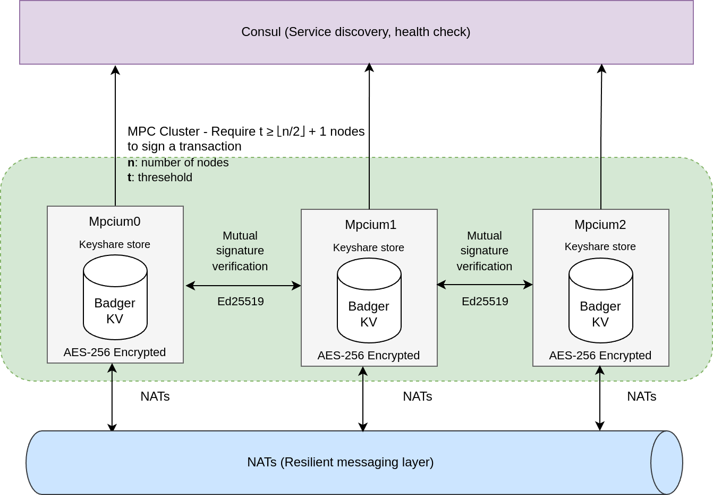

<div class="title-block" style="text-align: center;" align="center">

# mpcium: Resilient MPC (Multi-Party Computation) Nodes for Distributed Crypto Wallet Generation

> _"Setting up MPC wallets has always been painful, complex, and confusing. With MPCIUM, you can launch a secure MPC node cluster and generate wallets in minutes."_

<p></p>
<p><a href="https://t.me/+IsRhPyWuOFxmNmM9">Join our Telegram community to discuss MPCIUM and Web3 cyber security!</a></p>

[](https://go.dev/)
[](./LICENSE)
[](https://goreportcard.com/report/github.com/fystack/mpcium)
[](https://github.com/fystack/mpcium/releases)
[](https://t.me/+IsRhPyWuOFxmNmM9)
[](https://fystack.io)

</div>

Mpcium is a high-performance, open-source Multi-Party Computation (MPC) engine for securely generating and managing cryptographic wallets across distributed nodes—without ever exposing the full private key.

At its cryptographic core, Mpcium integrates tss-lib, a production-grade threshold signature scheme library developed by Binance. It supports:

- **ECDSA (secp256k1)**: Bitcoin, Ethereum, BNB, Polygon, and EVM-compatible L2 chains

- **EdDSA (Ed25519)**: for Solana, Polkadot, Cardano, and other modern blockchains

## Resources

- **MPC nodes**: [GitHub Repository](https://github.com/fystack/mpcium)
- **MPC clients**: 
  - [TypeScript Client](https://github.com/fystack/mpcium-client-ts)
  - [Golang Client](https://github.com/fystack/mpcium/blob/master/pkg/client/client.go)



## Archtecture documentation

[MPC Fundamental and MPCIUM architecture](https://deepwiki.com/fystack/mpcium)

---


## 📦 Dependencies Overview

| Dependency                                          | Purpose                                                                                                                                          |
| --------------------------------------------------- | ------------------------------------------------------------------------------------------------------------------------------------------------ |
| [NATS](https://nats.io)                             | Lightweight and resilient **messaging layer** for coordinating MPC nodes in real time. Enables pub/sub communication even under partial failure. |
| [Badger KV](https://github.com/dgraph-io/badger)    | High-performance **embedded key-value store** used for local encrypted storage of MPC key shares and session data.                               |
| [Consul](https://www.consul.io)                     | **Service discovery and health checking** to allow nodes to dynamically find each other and maintain cluster integrity.                          |
| [tss-lib](https://github.com/binance-chain/tss-lib) | Cryptographic engine for **threshold key generation and signing**, supporting ECDSA and EdDSA (used in Bitcoin, Ethereum, Solana, etc).          |
| [age](https://github.com/FiloSottile/age)           | **Modern encryption tool** used for secure key material storage and protection with password-based encryption.                                   |

## Threshold & Nodes

Mpcium uses a **t-of-n threshold scheme** to securely generate and sign with private keys.

- `n` = total number of MPC nodes (key shares)
- `t` = minimum number of nodes required to sign

Only `t` out of `n` nodes need to participate — the full private key is never reconstructed.

To maintain security against compromised nodes, Mpcium enforces:

```
t ≥ ⌊n / 2⌋ + 1
```

### Example: 2-of-3 Threshold

- ✅ `node0 + node1` → signs successfully
- ✅ `node1 + node2` → signs successfully
- ❌ `node0` alone → not enough shares

This ensures:

- No single point of compromise
- Fault tolerance if some nodes go offline
- Configurable security by adjusting `t` and `n`

## Architecture

### Overview

Each Mpcium node:

- Holds a **key share** in local AES-256 encrypted storage (via Badger KV)
- Participates in **threshold signing** using `tss-lib`
- Communicates over a **resilient messaging layer** using NATS
- Registers itself with **Consul** for service discovery and health checks
- Verifies incoming messages using **Ed25519-based mutual authentication**

### Message Flow & Signature Verification

1. A signing request is broadcast to the MPC cluster through **NATS** as an authenticated event. Each node **verifies the sender's Ed25519 signature** before processing the request.
2. NATS broadcasts the request to the MPC nodes.
3. Each participating node verifies:
   - The **signature** of the sender (Ed25519)
   - The **authenticity** of the message (non-replayable, unique session)
4. If the node is healthy and within the quorum (`t`), it:
   - Computes a partial signature using its share
   - Publishes the result back via NATS
5. Once `t` partial signatures are received, they are aggregated into a full signature.

---

### Properties

- **No single point of compromise**: Keys are never fully assembled
- **Byzantine-resilient**: Only `t` of `n` nodes are required to proceed
- **Scalable and pluggable**: Easily expand the cluster or integrate additional tools
- **Secure peer authentication**: All inter-node messages are signed and verified using Ed25519

## Installation and Run

For full installation and run instructions, see [INSTALLATION.md](./INSTALLATION.md).

## Preview usage

### Start nodes

```shell
$ mpcium start -n node0
$ mpcium start -n node1
$ mpcium start -n node2

```

### Client Implementations

- **Go**: Available in the `pkg/client` directory. Check the `examples` folder for usage samples.
- **TypeScript**: Available at [github.com/fystack/mpcium-client-ts](https://github.com/fystack/mpcium-client-ts)

### Client

```go

import (
    "github.com/fystack/mpcium/client"
    "github.com/nats-io/nats.go"
)


func main () {
	natsConn, err := nats.Connect(natsURL)
	if err != nil {
		logger.Fatal("Failed to connect to NATS", err)
	}
	defer natsConn.Close()
	mpcClient := client.NewMPCClient(client.Options{
		NatsConn: natsConn,
		KeyPath:  "./event_initiator.key",
	})
	err = mpcClient.OnWalletCreationResult(func(event mpc.KeygenSuccessEvent) {
		logger.Info("Received wallet creation result", "event", event)
	})
	if err != nil {
		logger.Fatal("Failed to subscribe to wallet-creation results", err)
	}

	walletID := uuid.New().String()
	if err := mpcClient.CreateWallet(walletID); err != nil {
		logger.Fatal("CreateWallet failed", err)
	}
	logger.Info("CreateWallet sent, awaiting result...", "walletID", walletID)
}
```
